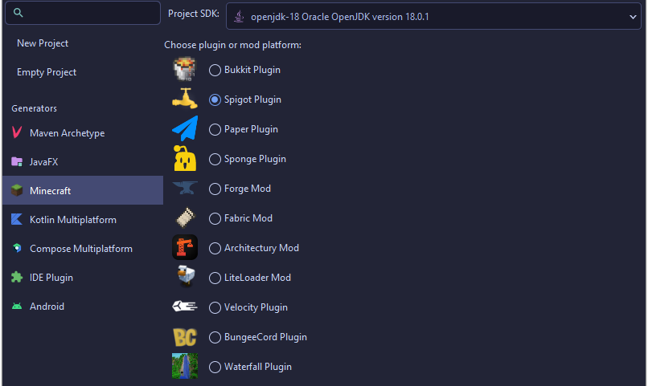
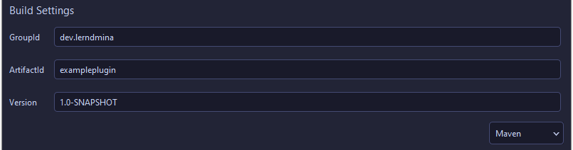
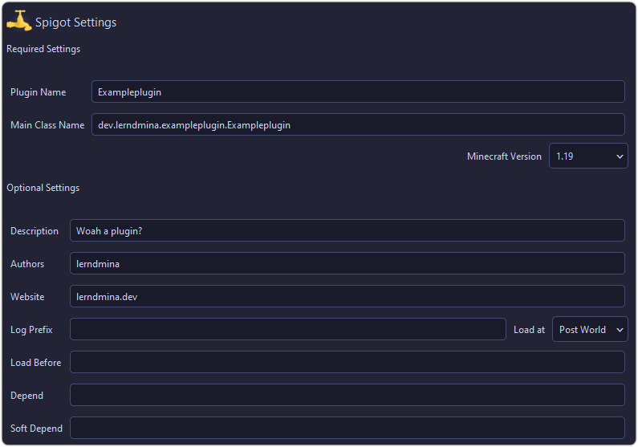
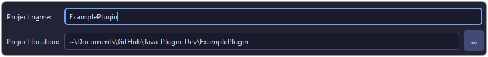
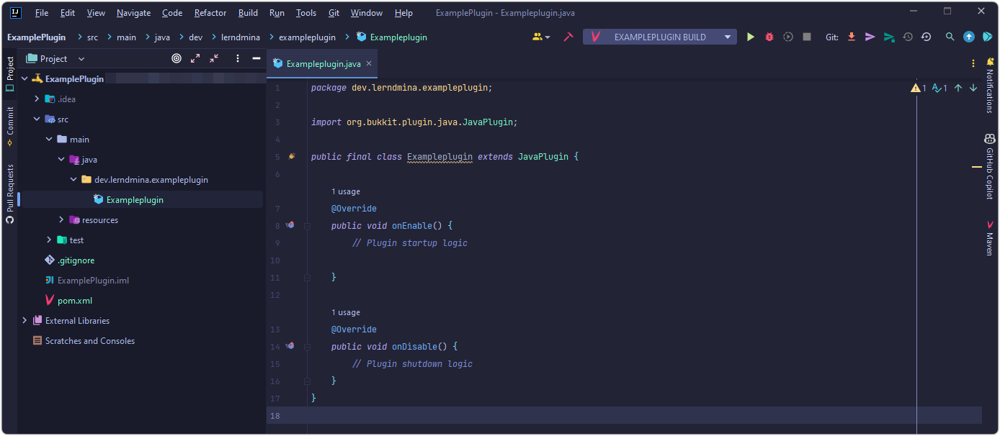
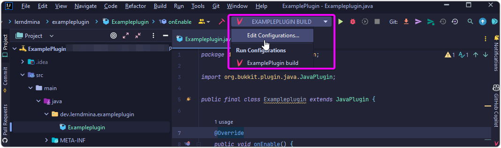
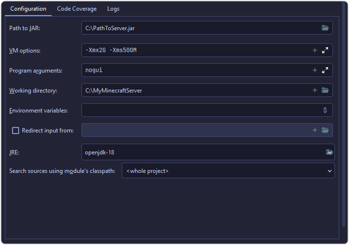

import Link from "../../components/Link.astro";
// import { Image } from "astro:assets";

# A New Journey

Ready for embarkation, let's begin.

## Step 1: Installing Essential Plugins

In my quest to delve into the realm of creating Minecraft Plugins using Java, my first crucial decision was choosing an appropriate <Link href="https://en.wikipedia.org/wiki/Integrated_development_environment" text="IDE" />.

I opted for <Link href="https://www.jetbrains.com/idea/" text="IntelliJ"/>. Its free accessibility for personal use, aesthetic dark theme, and extensive library of plugins proved too enticing to resist. In aid of this journey, I downloaded several plugins:

- <Link href="https://plugins.jetbrains.com/plugin/10044-atom-material-icons" text="Atom Material Icons" />
- <Link href="https://plugins.jetbrains.com/plugin/8006-material-theme-ui" text="Material Theme UI" />
- <Link href="https://plugins.jetbrains.com/plugin/8327-minecraft-development" text="Minecraft Development" />
- <Link href="https://plugins.jetbrains.com/plugin/8575-nyan-progress-bar" text="Nyan Progress Bar" /> (Because why not?)

## Step 2: Building A Project

Using the Minecraft Development plugin I was able to generate a ready-to-use project, designed specifically for working with Spigot. The plugin provides a wizard to guide you through the process of creating a new project.

To adhere to software engineering best practices, I used my Top-Level Domain (TLD) and website name for the GroupId and coined the name of the plugin as ArtifactID, yielding `dev.lerndmina` & `exampleplugin`. I chose Maven as my build tool, leaning on the fact that most tutorials utilize it.

Subsequently, I filled out necessary and optional plugin settings, especially paying attention to the Minecraft Version setting, which determines the API version I needed to reference in crafting my plugin.

Lastly, I designated a local name for my project and that marked completion of this setup phase!

Behold, the glorious main class!

The next step involves server setup for testing.

## Step 3: Establishing A Test Server

For my testing servers, my preference leans towards Paper since it offers both speed and stability. Let's navigate to <Link href="https://papermc.io/downloads" text="papermc.io"/>, and download the version we defined earlier in the plugin settings - `1.19`.

We create a folder to host our Minecraft Server, and move the server.jar file into it. Make sure to remember the jar file's name as it will be required later.

Returning to IntelliJ, the path to navigate is:  
`File > Project Structure > Artifacts > ➕ > JAR > From Modules With Dependencies...`

We specify the path to the Main Class, which in this case is `dev.lerndmina.exampleplugin.ExamplePlugin` and affirm with OK. The final alteration here pertains to the Output directory, set this to the plugins folder inside your Minecraft Server folder.

Sounds easy, right?

Next, we add the settings allowing IntelliJ to launch the server for us. With a single click, we can build and run the plugin. Navigate to your current build config and edit configurations.

A new Jar Application is created by clicking `➕ > 📦 Jar Application`, and providing a name for it.

Take a quick look at the image below to follow the process and customize according to your needs.

Finally, by navigating to the 'before launch' section and clicking the ➕, the build artifact task we created earlier is added.

And Voila! With just one push of a button, we can build our plugin and spin up a server to test it. Not too daunting after all, right?
